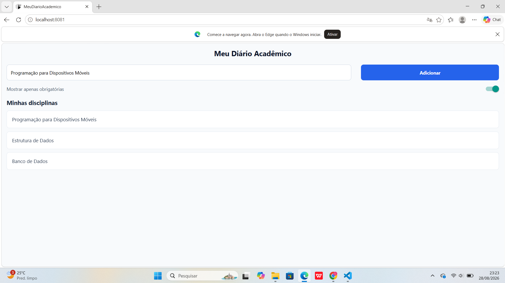

# MeuDiarioAcademico - Atividade 01

**Disciplina:** Programação para Dispositivos Móveis  
**Professor:** Marcelo Alves Farias — IESB  
**Aluna:** Luiza  Eduarda B Santos // 24214290026

---

### Comando Utilizado para Criar o Projeto

```bash
npx create-expo-app@latest MeuDiarioAcademico --template blank

```


## Screenshots do App

| Tela Principal | Switch Ativo (Desafio Extra) |
| :---: | :---: |
|  |  |


### Explicação do Layout e Componentes
Organização de Código: Todos os rótulos e textos visíveis na interface foram centralizados e exportados a partir do arquivo labels.js, sendo posteriormente importados no App.js.

Área Segura: A interface foi envolvida com o componente SafeAreaView da biblioteca react-native-safe-area-context para garantir exibição adequada em diferentes dispositivos.

Estrutura com Flexbox:

O container principal utiliza flex: 1 para ocupar 100% do espaço vertical disponível na tela.

A linha de cadastro (inputRow) faz uso de flexDirection: 'row', justifyContent: 'space-between' e alignItems: 'center' para alinhar horizontalmente o campo de texto e o botão.

Dimensões Percentuais:

O campo de entrada (TextInput) utiliza largura percentual de 70%.

O botão de ação utiliza largura percentual de 28%.

Desafios Opcionais Implementados:

Substituição do Button padrão pelo componente Pressable, adicionando estilização dinâmica (buttonPressed) para indicar quando o botão está sendo pressionado.

Adição do componente Switch para a opção "Mostrar apenas obrigatórias".