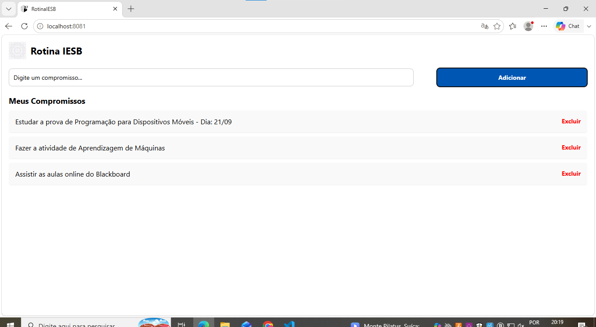
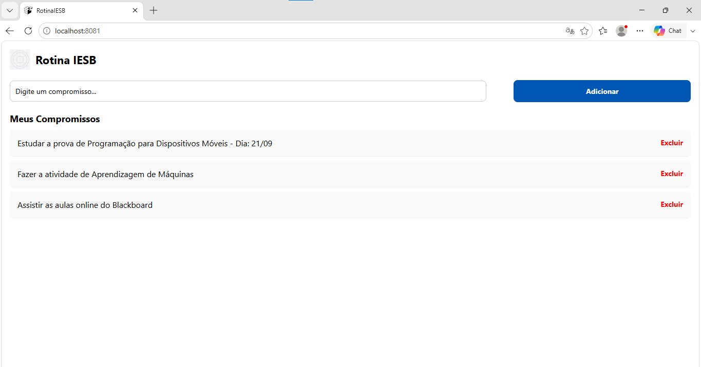

# RotinaIESB

Aplicativo mobile desenvolvido em React Native (Expo) para organizar a rotina acadêmica do aluno do IESB — cadastro, visualização e remoção de compromissos, com persistência local dos dados.

## 1. Comando usado para criar o projeto

npx create-expo-app@latest RotinaIESB --template blank

Dependências instaladas:

npx expo install @react-native-async-storage/async-storage react-native-safe-area-context

## 2. Prints do funcionamento

### Tela vazia (sem compromissos cadastrados)

### Tela com itens cadastrados

### Após reabrir o app (persistência funcionando)

## 3. Mapa do useEffect (carga e salvamento)

O código de persistência está em `App.js`:

- **useEffect de carga** (executado na montagem do app, array de dependências vazio `[]`): responsável por buscar os dados salvos no `AsyncStorage` com a chave `@rotina_iesb_compromissos` e popular o estado `compromissos` com `JSON.parse`.
- **useEffect de salvamento** (dependência `[compromissos]`): disparado toda vez que a lista de compromissos muda, salvando o array atualizado no `AsyncStorage` com `JSON.stringify`.

Ambos os blocos usam `try/catch` para tratar erros com `Alert.alert`.

## 4. Estrutura de arquivos

RotinaIESB/
App.js
labels.js
assets/
logo.png
components/
CompromissoInput.js
CompromissoList.js

- `labels.js`: centraliza os textos/rótulos usados na interface (título do app, placeholder, botão, título da lista, mensagem de lista vazia).
- `components/CompromissoInput.js`: componente do campo de texto + botão de adicionar compromisso.
- `components/CompromissoList.js`: componente da lista de compromissos (FlatList), com remoção via toque.

## 5. Funcionalidades implementadas

- Cadastro de compromissos com validação de campo vazio
- Listagem com FlatList e estado vazio customizado
- Remoção de item por toque (Pressable + filter por id)
- Persistência dos dados com AsyncStorage (JSON.stringify/JSON.parse)
- Layout responsivo com Flexbox (row/column, width %, flex)
- Componentização com props entre pai e filhos

## 6. Desafios opcionais implementados

- **O4**: Uso de FlatList com `ListEmptyComponent` no lugar de `.map`/`ScrollView`

